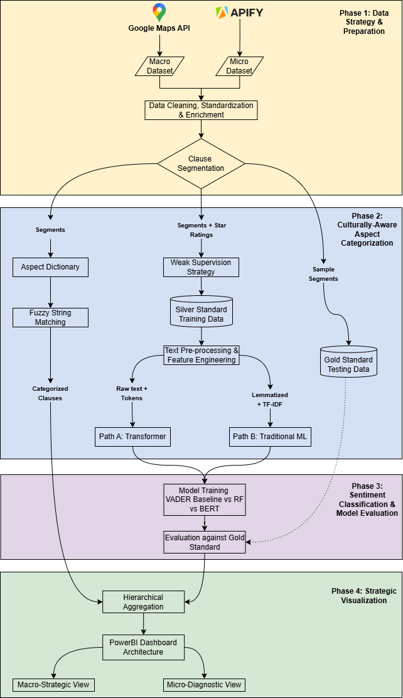

# Project Title: NLP-Driven Aspect-Based Sentiment Analysis for Gastronomy Tourism Insights in Malaysia

# Problem Statement

# Research Question
1.	What are the key cultural and local dining determinants that can be extracted from Malaysian gastronomy reviews using ABSA?
2.	How do various sentiment analysis architectures perform on Malaysian gastronomy tourism reviews?
3.	How can extracted sentiment insights be transformed into actionable decision-support tools for gastronomy tourism stakeholders?

# Research Objective
This study aims to develop an AI-driven strategic intelligence framework that leverages aspect-based sentiment analysis on Google Reviews data, to extract culturally relevant dining determinants and provide actionable insights for gastronomy tourism stakeholders in Malaysia. 
1)	To extract cultural and local dining determinants from code-switched Malaysian gastronomy reviews using Aspect-Based Sentiment Analysis (ABSA).
2)	To evaluate the classification performance of various sentiment analysis architectures on Malaysian gastronomy tourism reviews.
3)	To design an interactive intelligence dashboard to visualize granular sentiment insights, providing strategic benchmarks and actionable insights for gastronomy tourism stakeholders.

# Research Framework

