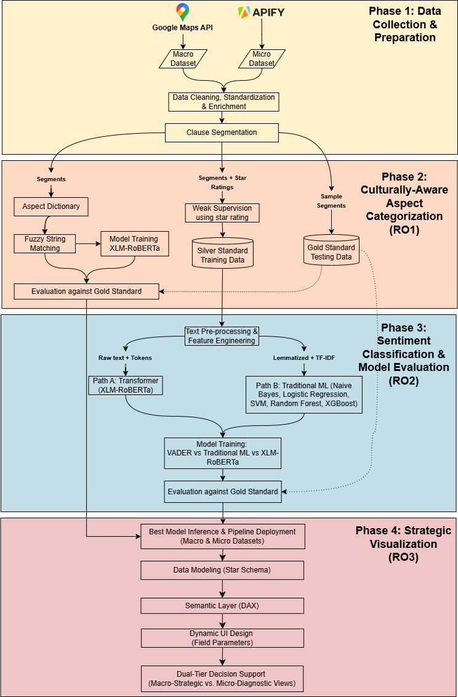

# Aspect-Based Sentiment Analysis for Gastronomy Tourism Insights in Malaysia (Google Maps)

Culturally-aware pipelined ABSA for code-switched Malaysian reviews with weak supervision from noisy star ratings.
Produces aspect categories + sentiment insights and feeds a Power BI decision-support dashboard: https://app.powerbi.com/view?r=eyJrIjoiYmIyNmFlNmQtOTY3MC00YjcwLTllOTktNjVjMzI1M2NlYTYzIiwidCI6ImE2M2JiMWE5LTQ4YzItNDQ4Yi04NjkzLTMzMTdiMDBjYTdmYiIsImMiOjEwfQ%3D%3D

# Problem Statement
Existing sentiment analysis frameworks fail to address the cultural and linguistic complexities of Malaysian gastronomy tourism.

**Research Gap 1: The Cultural Blind Spot**
- Dataset bias: Over-reliance on Western platforms (Yelp, TripAdvisor) vs. dominant local sources (Google Maps) (Darraz et al., 2025; Vemula et al., 2024)
- Linguistic failure: Standard English models fail to process code-switched "Manglish" text (Nawawi et al., 2024)
- Cultural blindness: Generic aspects ignore key domestic drivers like Halal compliance & Mamak culture (Ray et al., 2021; Yang et al., 2024)

**Research Gap 2: The Diagnostic Black Box**
- Metric limitation: Analytics focus on high-level visitor volume/ratings (Mahidin, 2025)
- Actionability deficit: Lack of granular, aspect-level insights prevents targeted operational improvement

## Our Solution: 
- A culturally-aware tourism intelligence framework that implement Aspect-Based Sentiment Analysis (ABSA) on Google Maps reviews.

#### Dashboard (Power BI)
- Live dashboard: https://app.powerbi.com/view?r=eyJrIjoiYmIyNmFlNmQtOTY3MC00YjcwLTllOTktNjVjMzI1M2NlYTYzIiwidCI6ImE2M2JiMWE5LTQ4YzItNDQ4Yi04NjkzLTMzMTdiMDBjYTdmYiIsImMiOjEwfQ%3D%3D
- Power BI input tables are generated in [Phase_4_Strategic_Visualization/4. STAR_schema_data_preparation.ipynb](Phase_4_Strategic_Visualization/4.%20STAR_schema_data_preparation.ipynb) and saved to:
	- [Dataset/PowerBI_input/MacroSentiments.csv](Dataset/PowerBI_input/MacroSentiments.csv)
	- [Dataset/PowerBI_input/MicroSentiments.csv](Dataset/PowerBI_input/MicroSentiments.csv)
	- [Dataset/PowerBI_input/RestaurantMetadata.csv](Dataset/PowerBI_input/RestaurantMetadata.csv)

# Research Question
1.	What are the key cultural and local dining determinants that can be extracted from Malaysian gastronomy reviews using ABSA?
2.	How do various sentiment analysis architectures perform on Malaysian gastronomy tourism reviews?
3.	How can extracted sentiment insights be transformed into actionable decision-support tools for gastronomy tourism stakeholders?

# Research Objective
This study aims to develop an AI-driven strategic intelligence framework that leverages aspect-based sentiment analysis on Google Reviews data, to extract culturally relevant dining determinants and provide actionable insights for gastronomy tourism stakeholders in Malaysia. 
1)	To extract cultural and local dining determinants from code-switched Malaysian gastronomy reviews using Aspect-Based Sentiment Analysis (ABSA).
2)	To evaluate the classification performance of various sentiment analysis architectures on Malaysian gastronomy tourism reviews.
3)	To design an interactive intelligence dashboard to visualize granular sentiment insights, providing strategic benchmarks and actionable insights for gastronomy tourism stakeholders.

# Research Framework

# Tech Stack
- **Language:** Python (3.10+)
- **Data Processing:** Pandas 
- **NLP Machine Learning**: VADER, Random Forest, Logistic Regression, XG Boost, Naive Bayes, SVM
- **Deep Learning:** PyTorch, HuggingFace Transformers
- **Model Architecture:** XLM-RoBERTa (Cross-Lingual)
- **Visualization:** Power BI (DAX, M Query)
- **Environment**: Google Colab
- **Compute**: L4 GPU

# Dataset
To support both broad trend analysis and granular diagnostic capability, the study utilized a dual-tier dataset structure:
1.	**Macro-Strategic Dataset (The "Breadth"):** Covers 3,860 restaurants across all states in Malaysia, with a limit of 5 most recent reviews per place (as of November 2025). This dataset aims to provide regional and category benchmarking support for governments and tourism boards.
2.	**Micro-Diagnostic Dataset (The "Depth"):** Contains the complete review history of six strategically selected restaurants. This dataset facilitates in-depth diagnostics, helping business owners and managers identify specific operational failure points and longitudinal sentiment shifts.

## Data (Files & Labels)
- **Macro (breadth) processed data:** [Dataset/clean_data2.csv](Dataset/clean_data2.csv)
- **Micro (depth) full-history data:** [Dataset/MicroDataset/final_micro.csv](Dataset/MicroDataset/final_micro.csv)
- **Weak labels (silver standard) for aspect supervision:** [Dataset/silver_std.csv](Dataset/silver_std.csv) (generated via aspect dictionary + fuzzy matching)
- **Gold standard (manual) evaluation set:** [Dataset/Final_Gold_Standard.csv](Dataset/Final_Gold_Standard.csv)

### Weak supervision used in this project
- **Aspect labeling:** domain aspect dictionary + fuzzy string matching (silver standard), later used to train XLM-RoBERTa for aspect categorization.
- **Sentiment labeling:** Google star ratings treated as noisy labels for training; final reporting is evaluated on the manually annotated gold standard.

# Models & Training (High Level)
This project follows a **pipelined (decoupled) ABSA** approach rather than end-to-end modeling:
1) **Aspect categorization** (dictionary weak labels → transformer classifier)
- Checkpoint: [Modelling/models/xlm_roberta_aspect_categorization_best.pt](Modelling/models/xlm_roberta_aspect_categorization_best.pt)
- Metrics: [Modelling/results/aspect_training_metrics.json](Modelling/results/aspect_training_metrics.json), [Modelling/results/aspect_gold_evaluation.json](Modelling/results/aspect_gold_evaluation.json)

2) **Sentiment classification** (noisy star ratings for training; gold for evaluation)
- Checkpoint: [Modelling/models/xlm_roberta_absa_best_after_filtering.pt](Modelling/models/xlm_roberta_absa_best_after_filtering.pt)
- Metrics: [Modelling/results/training_metrics_after_filtering.json](Modelling/results/training_metrics_after_filtering.json), [Modelling/results/gold_evaluation.json](Modelling/results/gold_evaluation.json)

# Evaluation
- **Gold standard dataset:** [Dataset/Final_Gold_Standard.csv](Dataset/Final_Gold_Standard.csv)
- **Aspect categorization evaluation report:** [Modelling/results/aspect_gold_evaluation.json](Modelling/results/aspect_gold_evaluation.json)
- **Sentiment evaluation report:** [Modelling/results/gold_evaluation.json](Modelling/results/gold_evaluation.json)

# Reproducibility: Run Order (Notebook Map)

| Step | Notebook | Purpose | Key outputs in this repo |
|---:|---|---|---|
| 1 | [Phase_1a_Data_Collection/1. DataCollection.ipynb](Phase_1a_Data_Collection/1.%20DataCollection.ipynb) | Collect Google Maps place + review data (macro breadth + micro depth). | Raw CSV exports (often saved to Google Drive; not committed). |
| 2 | [Phase_1b_Data_Preparation/1. BasicDataCleaning.ipynb](Phase_1b_Data_Preparation/1.%20BasicDataCleaning.ipynb) | Basic text/data cleaning for noisy, code-switched reviews. | Intermediate cleaned dataset (may be stored as local `.pkl`; not committed). |
| 3 | [Phase_1b_Data_Preparation/2. AttributEnrichment.ipynb](Phase_1b_Data_Preparation/2.%20AttributEnrichment.ipynb) | Attribute enrichment and final cleaning for downstream labeling/training. | [Dataset/clean_data2.csv](Dataset/clean_data2.csv) |
| 4 | [Phase_2_Culturally_Aware_Aspect_Categorization/1. SilverStandardDatasetCreation.ipynb](Phase_2_Culturally_Aware_Aspect_Categorization/1.%20SilverStandardDatasetCreation.ipynb) | Create weak labels (silver standard) from aspect dictionary + fuzzy matching. | [Dataset/silver_std.csv](Dataset/silver_std.csv) |
| 5 | [Phase_2_Culturally_Aware_Aspect_Categorization/2. AspectCategorization.ipynb](Phase_2_Culturally_Aware_Aspect_Categorization/2.%20AspectCategorization.ipynb) | Generate aspect-category labels (before/after filtering). | [Dataset/aspect_categorization_before_filter.csv](Dataset/aspect_categorization_before_filter.csv), [Dataset/aspect_categorization_after_filtering.csv](Dataset/aspect_categorization_after_filtering.csv) |
| 6 | [Phase_2_Culturally_Aware_Aspect_Categorization/4a. AspectDictionaryEvaluatioonOnGoldStandard.ipynb](Phase_2_Culturally_Aware_Aspect_Categorization/4a.%20AspectDictionaryEvaluatioonOnGoldStandard.ipynb) | Evaluate dictionary-based aspect assignment against the gold set. | [Dataset/Mismatched_Aspect_Gold_Standard.csv](Dataset/Mismatched_Aspect_Gold_Standard.csv) |
| 7 | [Phase_2_Culturally_Aware_Aspect_Categorization/4b. XLM_RoBERTa_Aspect_Categorization.ipynb](Phase_2_Culturally_Aware_Aspect_Categorization/4b.%20XLM_RoBERTa_Aspect_Categorization.ipynb) | Train XLM-RoBERTa to categorize aspects (beyond dictionary matching). | [Modelling/models/xlm_roberta_aspect_categorization_best.pt](Modelling/models/xlm_roberta_aspect_categorization_best.pt), [Modelling/results/aspect_training_metrics.json](Modelling/results/aspect_training_metrics.json), [Modelling/results/aspect_gold_evaluation.json](Modelling/results/aspect_gold_evaluation.json) |
| 8 | [Phase_3_Sentiment_Analysis/1. Traditional_ML.ipynb](Phase_3_Sentiment_Analysis/1.%20Traditional_ML.ipynb) | Train/evaluate classical ML baselines (VADER + ML classifiers). | Serialized ML artifacts (saved via `joblib`; not committed). |
| 9 | [Phase_3_Sentiment_Analysis/2b. XLM_RoBERTa_Training_AfterFiltering.ipynb](Phase_3_Sentiment_Analysis/2b.%20XLM_RoBERTa_Training_AfterFiltering.ipynb) | Train sentiment classifier (XLM-R) using weak supervision + filtering strategy. | [Modelling/models/xlm_roberta_absa_best_after_filtering.pt](Modelling/models/xlm_roberta_absa_best_after_filtering.pt), [Modelling/results/training_metrics_after_filtering.json](Modelling/results/training_metrics_after_filtering.json), [Modelling/results/gold_evaluation.json](Modelling/results/gold_evaluation.json) |
| 10 | [Phase_4_Strategic_Visualization/1. Macro_data_sentiments.ipynb](Phase_4_Strategic_Visualization/1.%20Macro_data_sentiments.ipynb) | Generate macro-level sentiment predictions (segment-level). | [Dataset/Output/segment_level_predictions.csv](Dataset/Output/segment_level_predictions.csv) |
| 11 | [Phase_4_Strategic_Visualization/2. Macro_data_aggregations.ipynb](Phase_4_Strategic_Visualization/2.%20Macro_data_aggregations.ipynb) | Aggregate predictions to state/category/restaurant + Kano model inputs. | [Dataset/Output/kano_model_input.csv](Dataset/Output/kano_model_input.csv), [Dataset/Output/state_level_summary.csv](Dataset/Output/state_level_summary.csv), [Dataset/Output/category_level_summary.csv](Dataset/Output/category_level_summary.csv), [Dataset/Output/state_category_summary.csv](Dataset/Output/state_category_summary.csv), [Dataset/Output/restaurant_aspect_aggregates.csv](Dataset/Output/restaurant_aspect_aggregates.csv) |
| 12 | [Phase_4_Strategic_Visualization/3. Micro_data_sentiments.ipynb](Phase_4_Strategic_Visualization/3.%20Micro_data_sentiments.ipynb) | Generate micro-level sentiment predictions (full history for selected restaurants). | [Dataset/MicroDataset/final_micro.csv](Dataset/MicroDataset/final_micro.csv) |
| 13 | [Phase_4_Strategic_Visualization/4. STAR_schema_data_preparation.ipynb](Phase_4_Strategic_Visualization/4.%20STAR_schema_data_preparation.ipynb) | Prepare STAR-schema tables for the Power BI dashboard. | [Dataset/PowerBI_input/MacroSentiments.csv](Dataset/PowerBI_input/MacroSentiments.csv), [Dataset/PowerBI_input/MicroSentiments.csv](Dataset/PowerBI_input/MicroSentiments.csv), [Dataset/PowerBI_input/RestaurantMetadata.csv](Dataset/PowerBI_input/RestaurantMetadata.csv) |

# Repository Structure
- [Dataset/](Dataset/) - Primary data artifacts (cleaned data, silver/gold standards, outputs, Power BI inputs)
	- [Dataset/Output/](Dataset/Output/) - Aggregations + Kano inputs for strategic analysis
	- [Dataset/PowerBI_input/](Dataset/PowerBI_input/) - STAR-schema tables loaded into Power BI
	- [Dataset/MicroDataset/](Dataset/MicroDataset/) - Full-history micro dataset for selected restaurants
- [Modelling/](Modelling/) - Trained weights + evaluation metrics
	- [Modelling/models/](Modelling/models/) - Saved PyTorch `.pt` checkpoints
	- [Modelling/results/](Modelling/results/) - Training curves + gold evaluation JSONs
- [Phase_1a_Data_Collection/](Phase_1a_Data_Collection/) - Google Maps data collection notebook
- [Phase_1b_Data_Preparation/](Phase_1b_Data_Preparation/) - Cleaning + attribute enrichment notebooks
- [Phase_2_Culturally_Aware_Aspect_Categorization/](Phase_2_Culturally_Aware_Aspect_Categorization/) - Weak-label creation + aspect categorization training/evaluation
- [Phase_3_Sentiment_Analysis/](Phase_3_Sentiment_Analysis/) - Traditional ML baselines + transformer sentiment training
- [Phase_4_Strategic_Visualization/](Phase_4_Strategic_Visualization/) - Aggregations + Power BI input table preparation
